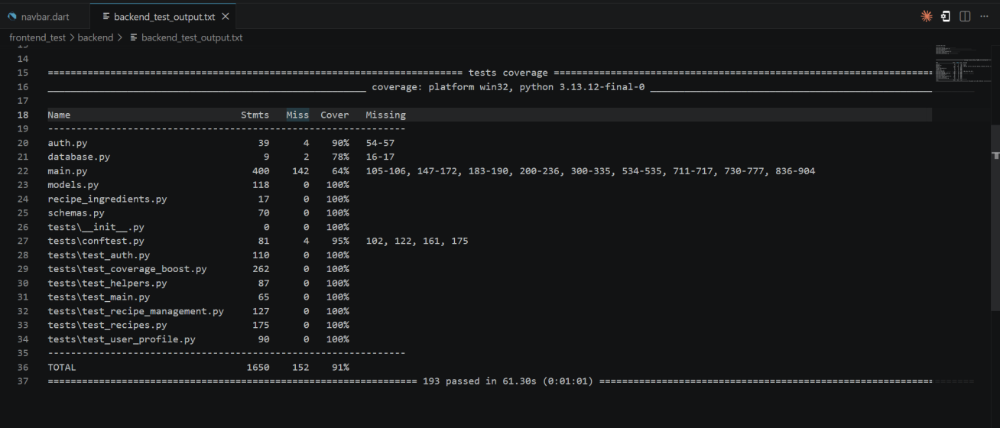

Testing
=======

The SimplyServe automated testing evidence focuses on the FastAPI backend, where API behaviour, database operations, authentication, recipe management, and error handling can be tested consistently using pytest.

Testing Methodology
-------------------

The backend test strategy uses requirement-based testing, equivalence partitioning, boundary value analysis, positive testing, negative testing, and error-state testing.

Each backend test is mapped to an implemented API endpoint, helper function, or backend behaviour. The tests check both successful requests and expected failure cases, including invalid input, duplicate data, missing authentication, invalid IDs, and malformed requests.

Backend Test Areas
------------------

Authentication Tests
~~~~~~~~~~~~~~~~~~~~

Authentication tests cover:

* User registration.
* Duplicate email handling.
* Login with valid credentials.
* Login with invalid credentials.
* JWT token generation.
* Protected route access.
* Missing or invalid bearer token handling.

User Profile Tests
~~~~~~~~~~~~~~~~~~

User profile tests cover:

* Retrieving the authenticated user's profile.
* Updating the user's profile name.
* Rejecting empty or invalid profile updates.
* Avatar upload validation where applicable.

Recipe API Tests
~~~~~~~~~~~~~~~~

Recipe tests cover:

* Listing recipes.
* Creating recipes.
* Updating recipes.
* Soft-deleting recipes.
* Listing deleted recipes.
* Restoring deleted recipes.
* Permanently deleting recipes.
* Handling nonexistent recipe IDs.

Ingredient Tests
~~~~~~~~~~~~~~~~

Ingredient tests cover:

* Searching ingredients.
* Empty search results.
* Query limits.
* Base ingredient filtering where applicable.

Helper Function Tests
~~~~~~~~~~~~~~~~~~~~~

Helper function tests cover:

* Unit normalisation.
* Ingredient text parsing.
* Ingredient payload validation.
* Nutrition calculation.
* Duplicate ingredient handling.
* Invalid quantity handling.

Backend Coverage
----------------

Backend coverage is generated using ``pytest`` and ``pytest-cov``.

The command used to generate the backend coverage report is:

.. code-block:: bash

   cd backend
   poetry run pytest tests/ --cov=. --cov-report=term-missing --cov-report=html:htmlcov --html=pytest-report.html --self-contained-html

This produces:

.. code-block:: text

   backend/htmlcov/index.html
   backend/pytest-report.html

``htmlcov/index.html`` shows the backend coverage report, while ``pytest-report.html`` shows the detailed pytest execution report.

Final Backend Test Evidence
---------------------------

The screenshot below shows the final backend automated test run and backend coverage evidence used before submission.

   Final backend test run and coverage evidence before submission.

Traceability
------------

The backend automated tests support the test plan by providing executable evidence for authentication, recipe management, user profile management, deleted recipe recovery, ingredient search, and backend helper functions.

Frontend validation is documented separately through the test plan, manual functional testing, and the video demonstration rather than through frontend coverage evidence.
